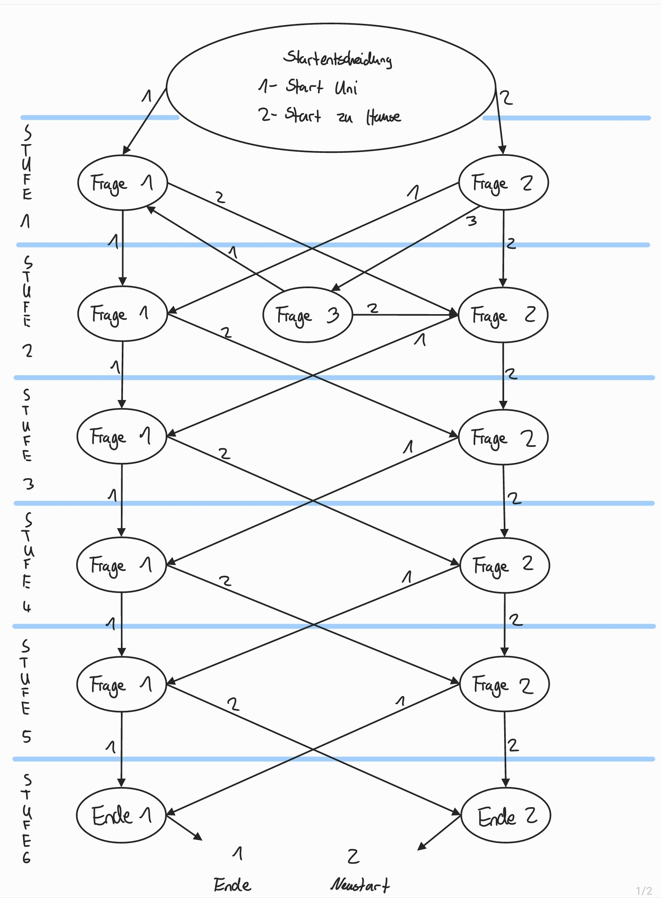

# CLassified - Das Spiel Projekt

## Das Team

+ Jonas Wagner: Entwickler und ***Scrummaster***
+ Omar Saloom Alissa: Entwickler und ***Schöpfer der GUI***
+ Felix Krull: Entwickler und ***Product Owner***

## Das Spiel

### Systemvorraussetzungen

+ eine möglichst aktuelle Java-Version
> Wichtig: Die Systeumgebungsvariablen müssen gesetzt sein, um die .java - Datei von der Consolen starten zu können

+ **Consolen-Version:**
  + eine angeschlossene und betriebsbereite Tastatur
  + eine Bash Shell z.B. die Git-Bash (da ANSI Escape Codes verwendet wurden)
  
+ **GUI-Version:**
  + eine angeschlossene und betriebsbereite Tastatur
  + eine angeschlossene und betriebsbereite Maus
  + eine beliebige Shell zum ausführen der .java Datei

-------------------

### Das Konzept / Die Idee

Die Spielidee stammt von dem Brettspiel "Spiel des Lebens" ab. Dabei handelt es sich um ein Spiel, bei dem man mit seiner Spielfigur ein "ganzes Leben" durchlebt, dabei entscheidet
hier der Würfel, was als nächstes passiert. Im Laufe des Spiels kann man dann auf Felder kommen, w.z.B. "Du wirst verhaftet - Eine Runde aussetzen", "Du hast bei einem Gewinnspiel
2.000€ gewonnen" oder aber Entscheidungs-Felder w.z.B. "Du hast die Möglichkeit in Aktien zu investieren".

Diese Spielidee wird in unserem Spiel aufgegriffen, jedoch wollten wir die Felder nicht sturr kopieren, sodass man in unserem Spiel die Möglichkeit hat, das Leben rund um ein
Informatik-Studium zu spielen. Ein großer Vorteil dieses Konzepts ist die Möglichkeit, das Spiel immer wieder mit neuen Fragen zu aktualisiern und auszubauen.

-------------------

### Die Umsetzung - Konsole

Die Umsetzung in der Konsole basiert in der Version 1.0 auf folgenden Klassen:
+ Game.java
+ LiveStep.java
+ LiveChoice.java  

#### Game-Klasse

Was beinhaltet die Game-Klasse?
+ Main-Methode
  + Initialisierung des Fragen(LiveStep)-Arrays
  + Setzen der einzelnen Fragen
  + Gameloop
+ verschieden Methoden für Features
  + clearScreen
  + checkGivenAnswer
  + checkUsesSpecialization
  + checkInput  

*[ausführliche Dokumentation](dokumentation/GameClass.md)*

#### LiveStep-Klasse

Was beinhaltet die LiveStep-Klasse?
+ Attribute
  + id
  + description
  + choices
  + choiceTaken
  + neededPreviousStep
  + neededPreviousAnswer
  + alternativeStep
  + usesSpecialization
+ Konstruktor (id, description, choices)
+ Getter und Setter für alle Attribute  

*[ausführliche Dokumentation](dokumentation/LiveStepClass.md)*

#### LiveChoice-Klasse

Was beinhaltet die LiveChoice-Klasse?
+ Attribute
  + description
  + nextStep
+ Konstruktor
+ Getter und Setter für alle Attribute

*[ausführliche Dokumentation](dokumentation/LiveChoiceClass.md)*

#### Player-Klasse

Was beinhaltet die Player-Klasse?
+ Attribute
  + name
  + credit
+ Konstruktor
+ Getter und Setter für alle Attribute
  + addMoney
  + removeMoney

*[ausführliche Dokumentation](dokumentation/PlayerClass.md)*

 
-------------------

### Die Geschichte

### Anfänglicher Entwurf zu den Fragen und deren Ablauf

### Anfänglicher Entwurf zum grundlegenden Spielablauf

