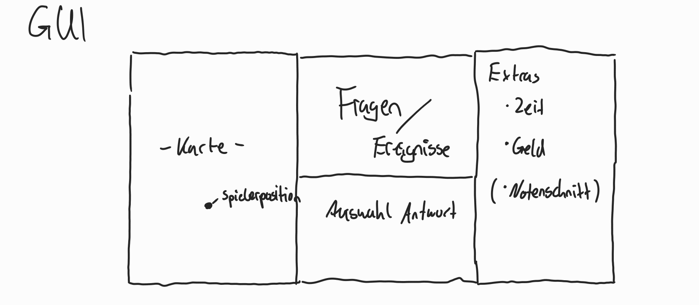

##### Die README vom Main Branch
Die Idee
=====
Story - Game auf der Konsole, mit kleineren Aufgaben und alternativen Enden, die auf den getroffenen Entscheidungen und Aufgaben basieren
+ Arten von "Spielfeldern" 
	+ Entscheidungen 		
	+ Tatsachen -> Ereignisse
	+ Belohnung
	+ Entscheidungen gebunden an Spielfortschritt (bsp. Guthaben)
+ Aufteilung in meherere Handlungstränge je nach Entscheidung oder mehrere Bereiche der Handlung (Bsp. Privatleben und Arbeitsleben)
+ Einteilung in zu entwickelnde Features
	+ Einzelne Handlungstränge als Features 
	+ GUI
	+ Extras (Einbindung von Scores, oder konkret Guthaben und Notenschnitt)

+ Grober Spielablaufplan 
+ Grobe Skizze der GUI 

Die Umsetzung
=====
+ Die Story: "Der Aufstieg als Informatiker"
+ Stufen: 
    + an der Arbeit
        + Studium
        + die Zeit der Entscheidung
        + die ersten 10 Jahre nach dem Studium
        + die zweiten 10 Jahre nach dem Studium
        + ...
    + privat
    	+ Studium
        + die Zeit der Entscheidung
        + die ersten 10 nach dem Studium
        + die zweiten 10 nach dem Studium
        + ...
+ Grafische Oberfläche
    + Basis Funktionen
    + Erweiterungen z.B. Zeit, Map, Geld(Guthaben), ...
+ Extras
	+ Startparameter
	+ Geld und Erfahrung mit einbeziehen; Fragen an Geld anbinden

+ Stufenplan:
	1. Stufe: 1/2 Semester
	2. Stufe: 3/5 Semester
	3. Stufe: 6 Semester/Bachelorarbeit
	4. Stufe: Wie gehts weiter nach dem Studium
	5. Stufe: variabel: bsp. Master / Selbstständig / Angestellter
	6. ...

